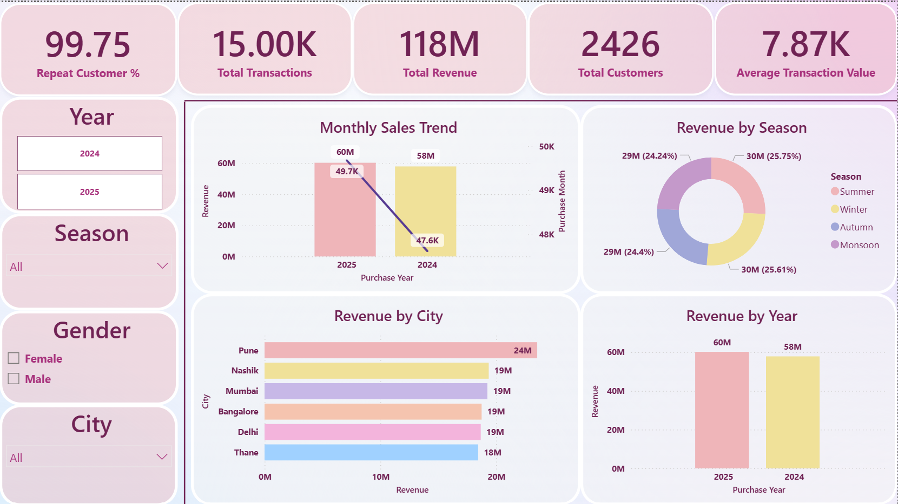
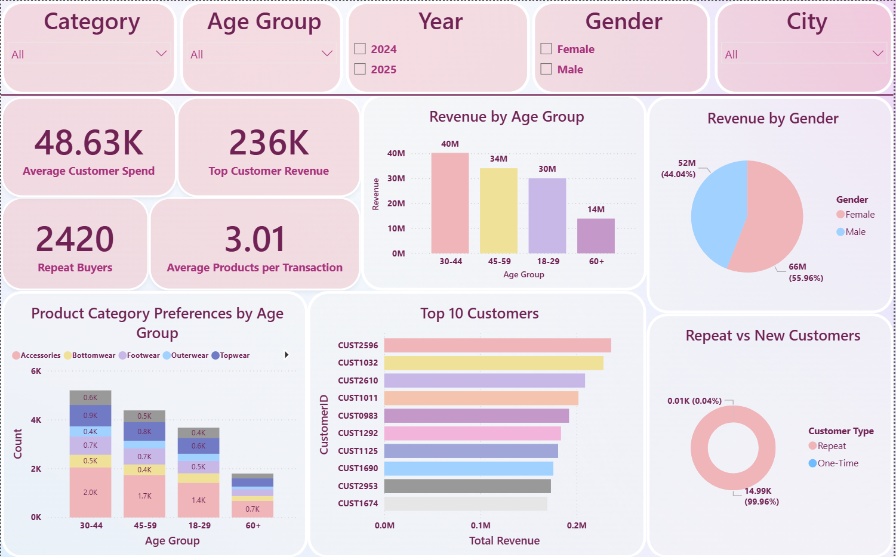
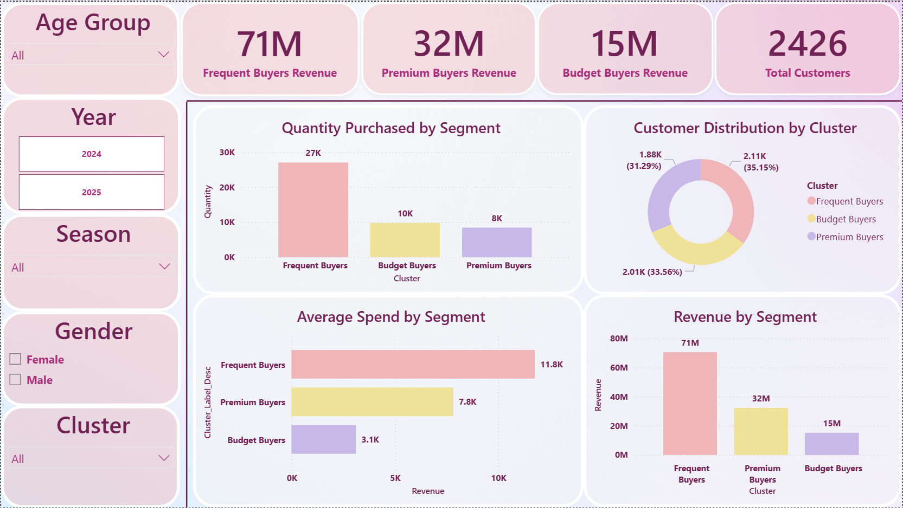
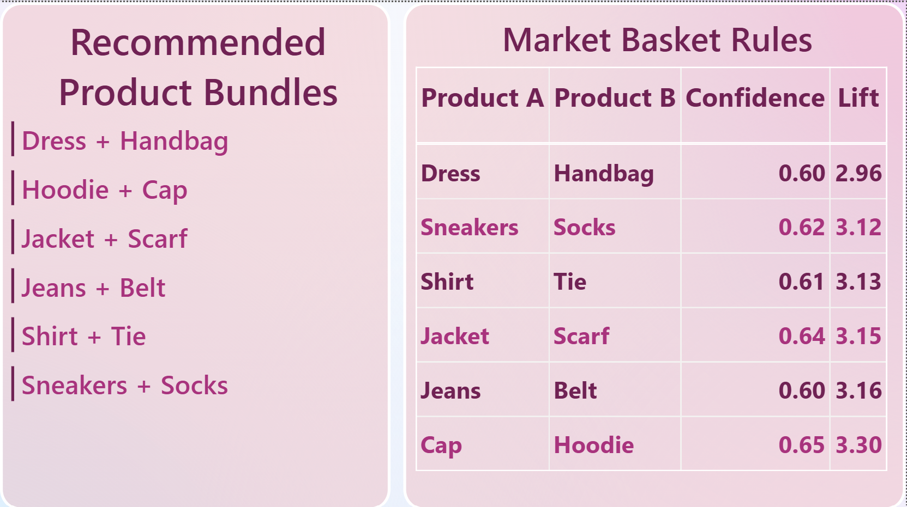

# Clothing Analysis: Data Analytics & Data Mining Project

## Project Overview

This project focuses on analyzing customer purchasing behavior in a clothing retail business using **Data Analytics**, **Data Mining**, **SQL**, and **Power BI**.

The objective was to transform raw transactional data into actionable business insights by identifying:

- Customer purchasing patterns
- Product associations
- Customer segments
- Sales trends
- High-value customers
- Cross-selling opportunities

The project follows a complete analytics workflow from **data cleaning** to **business recommendations**.

---

## Problem Statement

Retail businesses often struggle to understand customer purchasing behaviour and identify hidden relationships among products. Without analyzing transaction data, businesses cannot effectively segment customers, recommend products, or implement cross-selling strategies.

This project aims to:

- Analyze customer purchasing behaviour
- Discover frequently purchased product combinations
- Identify customer segments
- Generate actionable business recommendations

---

## Tools & Technologies

- Python
- Pandas
- NumPy
- Matplotlib
- SQL
- Power BI
- FP-Growth Algorithm
- Association Rule Mining
- K-Means Clustering

---

## Project Structure

```text
Clothing_Analysis
│
├── Data_Cleaning
│   ├── clothing_data.csv
│   ├── cleaned_excel.csv
│   └── cleaning.ipynb
│
├── Data_Analysis
│   ├── analysing.ipynb
│   ├── visualization.ipynb
│   ├── cleaned_excel.csv
│   └── final_data.csv
│
├── Data_Mining
│   ├── mining.ipynb
│   ├── association_rules.csv
│   └── cleaned_excel.csv
│
├── SQL
│   └── clothing.sql
│
├── Power_BI
│   └── clothing.pbix
│
├── Documentation
│   └── clothing.docx
│
└── Images
    ├── one.png
    ├── two.png
    ├── three.png
    └── four.png
```

---

# Data Cleaning

The dataset was cleaned using both **Excel** and **Python**.

### Cleaning Performed

- Removed duplicate records
- Handled missing values
- Standardized city names
- Corrected inconsistent gender values
- Converted date formats
- Fixed capitalization issues
- Removed unwanted spaces
- Treated outliers using IQR Method

---

# Feature Engineering

New attributes were created to enhance analysis:

| Feature | Description |
|----------|-------------|
| Age_Bin | Age categories |
| Age_Group | Customer age groups |
| Total_Spend | Quantity × Unit Price |
| Purchase_Year | Year extracted from purchase date |
| Purchase_Month | Month extracted from purchase date |
| Season | Derived season information |
| Cluster_Label_Desc | Customer segment labels |

---

# Data Analysis

A total of **35 business questions** were analyzed covering:

### Sales Performance
- Revenue trends
- Seasonal sales
- Transaction value analysis

### Product Analysis
- Best-selling products
- Revenue-generating categories
- Product demand analysis

### Customer Analysis
- Age group contribution
- Gender contribution
- City-wise performance

### Purchase Behaviour
- Repeat customers
- Average customer spending
- Customer loyalty

---

# Data Mining

## FP-Growth Algorithm

Used to discover frequently purchased product combinations.

### Strong Product Associations

| Product A | Product B | Confidence | Lift |
|------------|------------|------------|--------|
| Cap | Hoodie | 0.65 | 3.30 |
| Jeans | Belt | 0.60 | 3.16 |
| Jacket | Scarf | 0.64 | 3.15 |
| Shirt | Tie | 0.61 | 3.13 |
| Sneakers | Socks | 0.62 | 3.12 |
| Dress | Handbag | 0.60 | 2.96 |

---

## K-Means Clustering

Customer segmentation was performed using:

- Quantity Purchased
- Unit Price
- Age

### Customer Segments

| Segment | Description |
|----------|-------------|
| Frequent Buyers | Purchase highest quantity |
| Premium Buyers | Spend highest per product |
| Budget Buyers | Price-sensitive customers |

---

# Power BI Dashboard

## Executive Sales Dashboard



---

## Customer Behaviour Dashboard



---

## Customer Segmentation Dashboard



---

## Market Basket Analysis Dashboard



---

# Key Business Insights

- Summer generated the highest sales revenue.
- Accessories were the highest revenue-generating category.
- Customers aged **30-44** contributed the highest revenue.
- Female customers generated more revenue than male customers.
- Pune emerged as the highest revenue-generating city.
- 99.75% of customers were repeat buyers.
- Frequent Buyers generated the highest revenue among all customer segments.
- Strong product associations create opportunities for cross-selling and bundling.

---

# Business Recommendations

### Product Bundling

- Hoodie + Cap
- Jeans + Belt
- Jacket + Scarf
- Shirt + Tie
- Sneakers + Socks
- Dress + Handbag

### Customer Segmentation

- Loyalty programs for Frequent Buyers
- Premium campaigns for Premium Buyers
- Discount offers for Budget Buyers

### Seasonal Planning

- Increase inventory before Summer and Winter
- Run seasonal marketing campaigns

### Customer Retention

- Reward repeat customers
- Create VIP programs for high-value customers

---

# Results

- Identified hidden purchasing patterns

- Discovered customer segments

- Generated actionable business insights

- Built interactive Power BI dashboards

- Developed data-driven business recommendations

---

## Author

**Manasi Bhutra**

BCA Student | Aspiring Data Analyst

Skills: Python, SQL, Power BI, Data Analytics, Data Mining, Machine Learning
